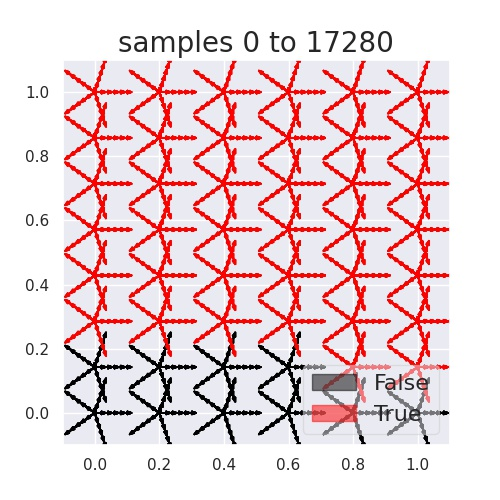
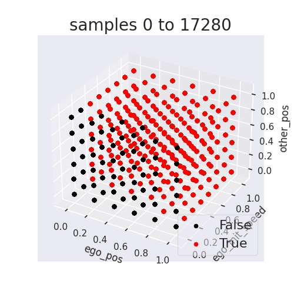
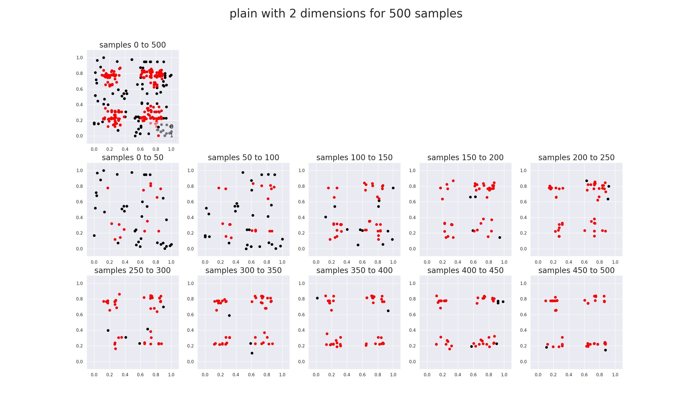
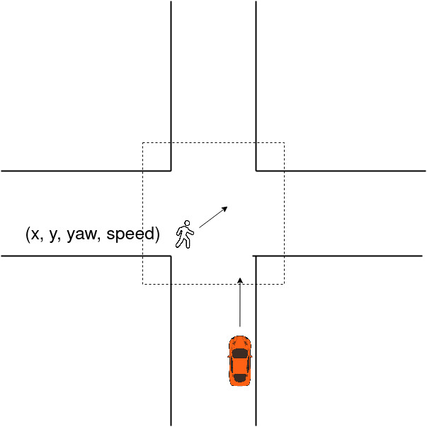
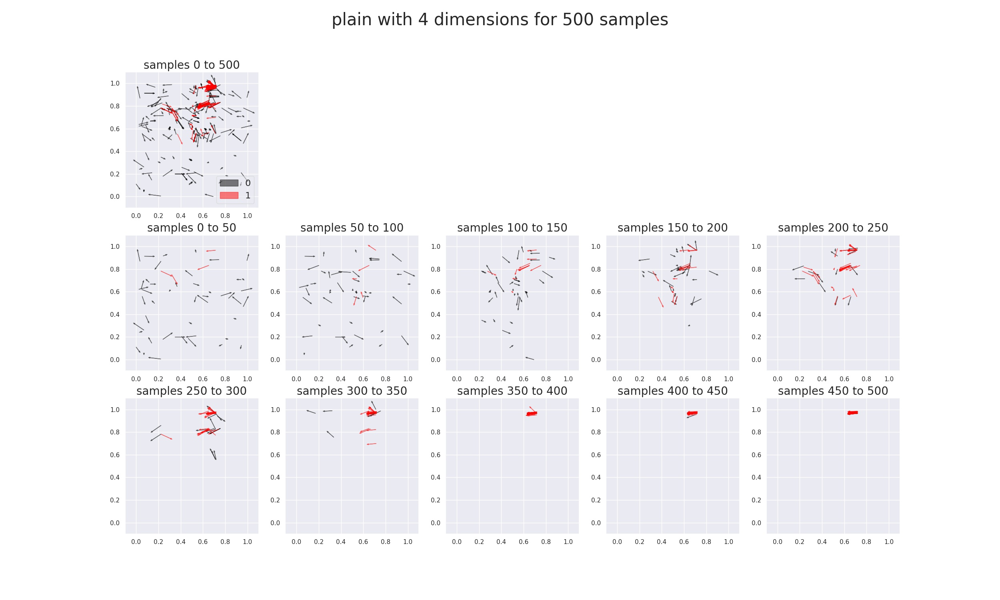
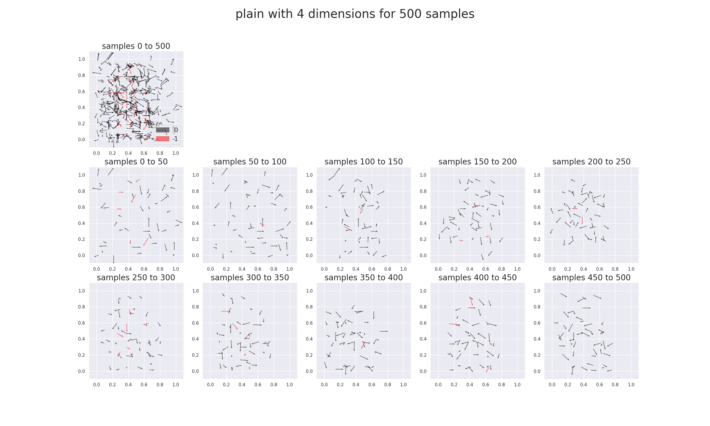

# Visualization

## Visualize a Given Dataset
### Oracle
A dataset in csv format. In this example, we use `no_simulation_dataset_script/grid.csv`.

### Parameters
#### Dataset Visualization Parameters
Set `folder_path`, `file_name`, `x_labels`, `y_label`, and visualization parameters at the end of `analysis_utils/visualize.py` based on their corresponding comments.

In the current example:

```
folder_path = 'no_simulation_dataset_script'
file_name = 'grid.csv'
x_labels = ['ego_pos', 'ego_init_speed', 'other_pos', 'other_init_speed', 'ped_delay', 'ped_init_speed']
y_label = 'oob'
```

#### Common Parameters
For 2D,

```
num_subplots = 1
mode = 'plain'
dim = 4
chosen_labels = ['ego_pos', 'ego_init_speed', 'other_pos', 'other_init_speed']
plot_dim = 2
interactive_mode = False
```

For 3D,

```
num_subplots = 1
mode = 'plain'
dim = 3
chosen_labels = ['ego_pos', 'ego_init_speed', 'other_pos']
plot_dim = 3
interactive_mode = False
```

### Commands
Then, run
```
python analysis_utils/visualize.py
```

The result (2D) is shown below:



The result (3D) is shown below:



## Fuzzing + Visualization - No Simulation (Function)
### Oracle
An synthetic function `four_modes` (defined in `no_simulation_function_script/synthetic_functions.py`) is used as the oracle.

### Search Space
```
x1: [-1, 1]
x2: [-1, 1]
```

### Parameters
#### Fuzzing + Visualization Parameters
In `analysis_utils/visualize.py`, change `folder_path` to the folder containing the fuzzing result. In this case, it should have a path similar to `no_simulation_function_script/run_results_no_simulation/nsga2/four_modes/<specific folder name with fuzzing starting time>'`.

#### Common Parameters
Make sure `chosen_labels` in `analysis_utils/visualize.py` is a subset of `scenario_labels` in `ga_fuzzing.py` (under the elif block of 'no_simulation_function').
```
num_subplots = 10
mode = 'plain'
dim = 2
chosen_labels = ['x1', 'x2']
plot_dim = 2
interactive_mode = False
```

### Commands
Run fuzzing for a specified function using an algorithm one wants to use based on the instruction at [No Simulation (Function)](https://github.com/AIasd/ADFuzz/blob/main/doc/stack4_no_simulation_function.md). Here, we use the algorithm `GA` for the synthetic function `four_modes`.
```
python ga_fuzzing.py --simulator no_simulation_function --n_gen 10 --pop_size 50 --algorithm_name nsga2 --has_run_num 500 --n_offsprings 200 --only_run_unique_cases 0 --use_unique_bugs 0 --synthetic_function four_modes
```

Then, run
```
python analysis_utils/visualize.py
```

The resulted figure is saved in the `folder_path`. The generated figure is shown below:




## Fuzzing + Visualization - CARLA + LBC
### Oracle
The stack [CARLA0.9.9+LBC](https://github.com/AIasd/ADFuzz/blob/main/doc/stack1_carla_lbc.md) is used.

### Search Space
The search space is a logical space about a pedestrian crossing the street starting from a point within a square region of the an intersection. The ego car is passing through the intersection.

The scenario looks like the following:



The search space is:
```
pedestrian_x: [-12, 12]
pedestrian_y: [-12, 12]
pedestrian_yaw: [0, 360]
pedestrian_speed: [0, 3]
```

### Parameters
#### Fuzzing + Visualization Parameters
In `analysis_utils/visualize.py`, change `folder_path` to the folder containing the fuzzing result. In this case, it should have a path similar to `no_simulation_function_script/run_results_no_simulation/<algorithm_name>/town07_front_0/go_straight_town07_one_ped/lbc/<specific folder name with fuzzing starting time>'`.

#### Common Parameters
```
num_subplots = 10
mode = 'plain'
dim = 4
chosen_labels = ['ego_pos', 'ego_init_speed', 'other_pos', 'other_init_speed']
plot_dim = 2
interactive_mode = False
```

### Commands
#### GA
```
python ga_fuzzing.py -p 2015 --n_gen 10 --pop_size 50 -r 'town07_front_0' -c 'go_straight_town07_one_ped' --algorithm_name nsga2 --has_run_num 500 --objective_weights -1 1 1 0 0 0 0 0 0 0 --check_unique_coeff 0 0.1 0.5 --record_every_n_step 5 --debug 0 --only_run_unique_cases 0
```

Then, run
```
python analysis_utils/visualize.py
```

The result is shown below:




#### AutoFuzz
```
python ga_fuzzing.py -p 2015 --n_gen 10 --pop_size 50 -r 'town07_front_0' -c 'go_straight_town07_one_ped' --algorithm_name nsga2-un --has_run_num 500 --objective_weights -1 1 1 0 0 0 0 0 0 0 --check_unique_coeff 0 0.1 0.5 --record_every_n_step 5 --debug 0 --rank_mode adv_nn
```

Then, run
```
python analysis_utils/visualize.py
```

The result is shown below:


